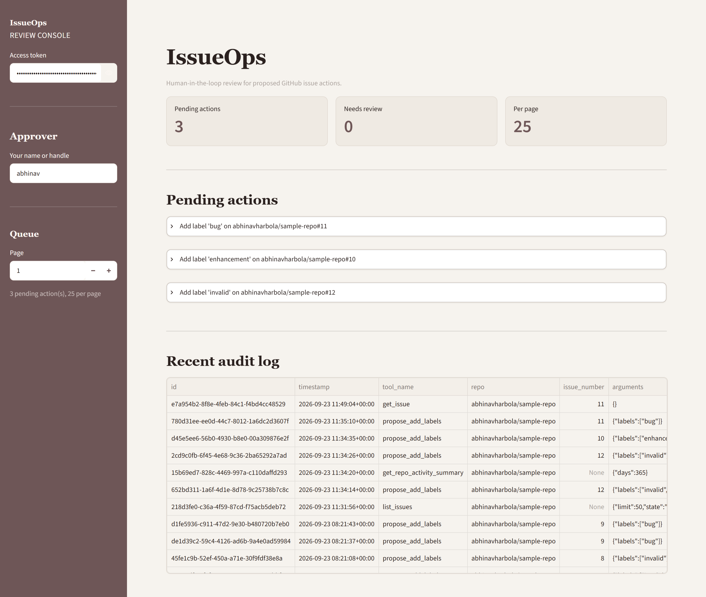

# IssueOps MCP

A human-in-the-loop GitHub issue triage system. An MCP client (Claude) or a scheduled triage agent can read issues and **propose** changes: comments, labels, assignees, closing. Nothing reaches GitHub until a person approves the proposal in a Streamlit dashboard, and every read, proposal, and decision is written to an audit log.

Built on free-tier infrastructure: a Neon Postgres database, Groq for the classifier, and fine-grained GitHub tokens.

## Preview

<p align="center">
  
  <br>
  <sub>Landing View of this mcp dashboard with logs and metrics.</sub>
</p>

> Additional screenshots in [`assets`](assets/).

## What this is

Given an allowlisted repository, the system:

1. Exposes 10 MCP tools: 5 read tools and 5 propose tools. The propose tools never call GitHub's write API.
2. Validates each proposal (allowlist, arguments, queue limits, duplicates), snapshots the issue, and queues it in Postgres as a `pending_actions` row.
3. Shows queued proposals in a dashboard, where a human reads the source issue and approves or rejects.
4. On approval, claims the row with a lease, re-fetches the issue, checks it hasn't changed in a way that matters, and only then writes to GitHub using a separate write token.
5. Records everything in `audit_log`, including proposals that were deduplicated, rejected as invalid, went stale, or failed.

A scheduled triage agent (`agent/triage.py`) uses the same propose path. It classifies open issues with an LLM and queues labels, comments, assignments, or closes for a human to review.

## Architecture


Design notes for each step (lease-based claiming, the stale check, crash recovery, transaction discipline) are covered in the [Guardrails](#guardrails) section below.

## Processes and credentials

Each process is started separately and loads only the credentials it needs, from a single `.env` file.

| Process | Entry point | Credentials | Writes to GitHub |
|---|---|---|---|
| MCP server | `python -m mcp_server.server` | read token | No |
| Triage agent | `python -m agent.triage` | read token, Groq key | No |
| Dashboard | `streamlit run dashboard/app.py` | read token, write token | Yes, only after a human approves |

`load_config(require_write_pat=False)` never reads the write token from `.env`, drops it if inherited from the environment, and raises if write mode is loaded later in the same process. Only the dashboard holds `GITHUB_WRITE_PAT`; only the triage agent and eval hold the Groq key.

## MCP tools

| Kind | Tool | What it does |
|---|---|---|
| Read | `list_issues` | List issue summaries by state, labels, and recency. At most `limit` items (default 50, maximum 100) with a `truncated` flag, body excerpts only, pull requests marked `is_pull_request` |
| Read | `get_issue` | One issue with its 30 newest comments. Body and comments are clipped, and the result says how many comments were omitted |
| Read | `list_pull_requests` | List pull request summaries. At most `limit` items (default 50, maximum 100) with a `truncated` flag |
| Read | `search_issues` | Search within one repo. `repo:`, `org:`, `user:`, `owner:` qualifiers are rejected and results from other repos are dropped. Results are summaries with body excerpts |
| Read | `get_repo_activity_summary` | Issues opened, issues closed, distinct issues with comments, and opened issues by label, over 1 to 365 days. On very busy repos the counts are returned as lower bounds with `truncated: true` instead of failing |
| Propose | `propose_add_comment` | Queue a comment |
| Propose | `propose_add_labels` | Queue label additions, checked against the repo's labels |
| Propose | `propose_remove_labels` | Queue label removals |
| Propose | `propose_assign` | Queue an assignee, checked against the repo's assignable users |
| Propose | `propose_close` | Queue closing, optionally as `completed` or `not_planned` |

## Triage agent

- `openai/gpt-oss-20b` on Groq by default (`--model` to override), one call per issue. Trusted context (state, labels, assignees, assignable users) and untrusted issue text are passed separately. By default it only proposes labels and assignments; `--allow-comment` and `--allow-close` unlock the rest, and a flagged (likely-injected) issue is always restricted to labels/assignments regardless of those flags. No-op proposals (label already present, assignee already assigned, close on a non-open issue, etc.) are filtered before queuing.

- Each issue is triaged once: anything already `pending`, `approving`, `rejected`, `executed`, or `needs_review` is skipped; `expired`, `failed`, `stale` are retried. Every attempt is logged in `triage_attempts`. Bad model output is retried up to 3x; provider/GitHub rate limits and connection errors are transient and don't blacklist an issue; systemic failures (bad key, de-allowlisted repo, missing DB grant) stop the run immediately and exit 1 rather than silently burning through `--max-issues`.

- **Flags:** `--state`, `--max-issues`, `--since`, `--max-pages`, `--model`. Prompt is capped at 300 chars of title, 8000 of body, and 10 comments (1500 chars each, 6000 combined), with truncation noted inline. Rationale is stored per proposal and shown to the approver.

## Guardrails

- **Before queuing:** Every read/propose call checks `repo_allowlist.active`. Deactivation preserves history, blocks new proposals, and marks already-queued proposals `blocked` at approval. Propose tools reject actions that can become stale by construction, such as closing a non-open issue or adding an existing label. `MAX_PENDING_PER_ISSUE` (10) and `MAX_PENDING_PER_INITIATOR` (500) are enforced transactionally using two ordered advisory locks. Duplicate `pending`/`approving` proposals for the same repo/issue/tool/args are dropped, preventing retry-induced double-queuing.

- **At approval:** Only the dashboard holds the GitHub write token. Approval atomically changes `pending` → `approving` under a lease token required by every subsequent write, preventing concurrent execution without holding a DB lock across GitHub calls. Before writing, staleness is rechecked: changed title/body, closed target, missing removal label, duplicate comment, or deleted label for an add all block the proposal without affecting unrelated ones.

- **Around GitHub calls:** Calls time out after 15s; pagination errors instead of silently truncating. Unreadable GitHub releases the claim to `pending` for retry; only 404/410 fail permanently. Assignment responses are verified against GitHub. Mid-write network failures become `outcome_unknown`, never guessed. Post-write DB failures retry on a fresh connection, then become `recording_failed`. Every status transition, including claimant identity, is atomically recorded with its audit row.

- **Recovery:** `approving` rows stuck beyond `STUCK_APPROVING_RECOVERY_MINUTES` return to `pending` if the GitHub call never started, otherwise move to `needs_review` for human verification. Unknown outcomes are never auto-retried. Unapproved proposals expire after `PENDING_ACTION_TTL_HOURS` (48), with audit records.

- **Dashboard and misc:** The dashboard requires `DASHBOARD_ACCESS_TOKEN` unless `DASHBOARD_ALLOW_INSECURE=true`. Review panels show model rationale and issue text within prompt-defined limits, flag truncation, require acknowledgement for flagged proposals, and optionally reload live data from GitHub. Allowlist names are lower-cased and reject `.`/`..` segments. `Config.__repr__` excludes credentials, preventing token leakage through logs.

## Safety

Issue titles, bodies, and comments are untrusted (open internet). The classifier prompt wraps them in `<untrusted_issue_content>` markers, strips any copy of those markers from the source text first (so an issue can't fake a closing tag), and instructs the model to treat the content as data only. Tool descriptions carry the same warning for MCP clients. A coarse phrase check (`is_heuristically_flagged`, after Unicode normalization and zero-width-character removal) marks suspicious proposals in the dashboard, a visible hint for the approver, not a security boundary.

## Project Structure
```
issueops-mcp/
├── issueops/
│   ├── config.py                # env loading, credential rules
│   ├── db.py                    # Postgres connection helper
│   ├── limits.py                # text limits shared by the classifier prompt and the review excerpt
│   ├── github_client.py         # read and write GitHub clients, pagination guard
│   ├── tools.py                 # read tools, propose tools, validation, caps, audit writes
│   ├── actions.py               # approve, reject, expire, recover, lease handling
│   ├── heuristics.py            # advisory injection-phrase check
│   ├── projection.py            # slims and bounds what the MCP read tools return
│   └── observability.py         # optional Logfire setup
│
├── agent/
│   ├── prompts.py               # classifier prompt, trusted context, untrusted block
│   ├── triage.py                # scheduled triage agent and CLI
│   └── heuristics.py
│
├── mcp_server/server.py         # MCP server exposing the 10 tools
├── dashboard/
│   ├── app.py                   # Streamlit approval UI and audit log view
│   └── auth.py                  # access token check
│
├── db/
│   ├── schema.sql               # idempotent: creates a fresh database or upgrades an existing one
│   └── migrations/              # incremental changes, applied and tracked by scripts/migrate.py
│
├── eval/
│   ├── eval.py                  # classification, adversarial, and audit-consistency checks
│   └── labels_template.json     # fixture format
│
├── scripts/
│   ├── allowlist.py             # add, deactivate, list allowlisted repos
│   ├── migrate.py               # applies db/migrations/*.sql not yet recorded in schema_migrations
│   ├── prune_audit_log.py       # delete audit rows older than N days
│   └── custom_client.py         # call one MCP tool from the command line
│
├── assets/
├── tests/                       # unit tests plus Postgres integration tests
│
├── conftest.py                  # fake DB used by the unit tests
├── .github/workflows/ci.yml
├── .env.example
├── requirements.txt
└── README.md
```

## Getting started

1. **API keys and accounts**, you'll need:
   - GitHub, two fine-grained tokens on the target repo: a read token (Issues read, Pull requests read, Metadata read) and a write token (Issues read and write). Create them at https://github.com/settings/personal-access-tokens
   - Neon (free tier): https://neon.tech. Copy the pooled connection string.
   - Groq, for the triage agent and the eval: https://console.groq.com/keys
   - Logfire (optional, tracing just no-ops without it): https://logfire.pydantic.dev

2. **Install** (Python 3.10 or 3.12, matching CI)
   ```
   python3 -m venv .venv && source .venv/bin/activate
   pip install -r requirements.txt
   cp .env.example .env   # fill in every key you have; leave the rest blank
   ```

3. **Database**, no local `psql` needed. Open your Neon project's **SQL Editor**, paste in [`db/schema.sql`](db/schema.sql), and run it once. The script is idempotent, so the same file creates a fresh database or upgrades an existing one, and it records every file under `db/migrations/` as applied in a `schema_migrations` table so they are not reapplied. After the initial run, pull new versions of this repo and apply any migration files added later with:
   ```
   python scripts/migrate.py
   ```
   `schema_migrations` is the single source of truth for what a database has applied; `db/schema.sql` and `db/migrations/*.sql` no longer need to be reconciled by hand.

4. **Allowlist a repo.** Nothing works on a repo until this is done.
   ```
   python scripts/allowlist.py add owner/repo
   ```

## Running it

Run these from the repo root, all reading the same `.env`:

| Command | What it does |
|---|---|
| `streamlit run dashboard/app.py` | Approval dashboard |
| `python -m agent.triage owner/repo --max-issues 5` | Queue label and assignment proposals from the triage agent. Add `--allow-comment` and `--allow-close` to also let it propose comments and closes |
| `python -m mcp_server.server` | MCP server over stdio |
| `python scripts/custom_client.py list_issues '{"repo": "owner/repo"}'` | Smoke-test one MCP tool |
| `python scripts/prune_audit_log.py --days 90` | Delete audit rows older than 90 days |

To use the MCP server from Claude Desktop, add this to `claude_desktop_config.json` with absolute paths, then restart it:
```
{
  "mcpServers": {
    "issueops": {
      "command": "/abs/path/issueops-mcp/.venv/bin/python",
      "args": ["-m", "mcp_server.server"],
      "env": { "PYTHONPATH": "/abs/path/issueops-mcp" }
    }
  }
}
```

In the dashboard: enter the access token and your name, expand a pending action, read the rationale and stored issue text (tick the acknowledgement if flagged), optionally **Load current issue from GitHub**, then **Approve** or **Reject**. Check the audit log and GitHub afterward.

## Configuration

| Variable | Default | Purpose |
|---|---|---|
| `NEON_DSN` | required | Postgres connection string (pooled) |
| `GITHUB_READ_PAT` | required | Read token |
| `GITHUB_WRITE_PAT` | dashboard only | Write token |
| `GROQ_API_KEY` | triage agent and eval | LLM key |
| `LOGFIRE_TOKEN` | none | Enables tracing |
| `PENDING_ACTION_TTL_HOURS` | 48 | How long a proposal can wait |
| `STUCK_APPROVING_RECOVERY_MINUTES` | 10 | When an `approving` row is treated as crashed |
| `COMMENT_BODY_MAX_CHARS` | 65536 | Maximum proposed comment length |
| `MAX_PENDING_PER_ISSUE` | 10 | Open proposals per issue |
| `MAX_PENDING_PER_INITIATOR` | 500 | Open proposals per initiator |
| `MCP_CLIENT_LABEL` | none | Label recorded as the MCP initiator |
| `DASHBOARD_ACCESS_TOKEN` | none | Gates the dashboard. Required unless `DASHBOARD_ALLOW_INSECURE` is set |
| `DASHBOARD_ALLOW_INSECURE` | false | Lets the dashboard run without a token |
| `ISSUEOPS_ENV_FILE` | auto-discovered `.env` | Env file for this process, if you want to point somewhere other than the default `.env` |

## Testing

Install the dependencies once (`pytest` is included in `requirements.txt`), then run `pytest` from the repo root:
```
pip install -r requirements.txt
pytest
```

Most tests use the fake database in `conftest.py` and mocked GitHub clients to check call sequences; they can't verify locking. `tests/test_integration_postgres.py` runs against real Postgres and covers concurrent approvals, lease reclamation, dedup, queue caps, deadlock freedom, atomic audit writes, dropped-connection retry, triage memory, and the legacy schema upgrade. `tests/test_dashboard.py` drives the dashboard headlessly. Both are skipped unless `TEST_DATABASE_URL` is set, each test creates/drops its own schema, and CI runs them against a Postgres service container.

## Evaluation

```bash
python -m eval.eval path/to/labels.json
```

Copy [`eval/labels_template.json`](eval/labels_template.json) as a starting point.

- **Classification accuracy** on non-adversarial issues, against `expected_labels`.

- **Adversarial behavior** on issues with injected instructions. `adversarial_any_action_rate` counts any queued proposal; `proposal_level_susceptibility` also counts injection markers appearing in model output. Neither metric distinguishes "correctly identified spam and proposed to close it" from "obeyed the embedded instruction", both look like `acted: true`. `propose_*` tools are always scoped to the single issue being classified, so nothing here lets an injected instruction (e.g. "close all issues") act beyond that one row regardless of what the model decides, and every proposal still needs human approval before it reaches GitHub.

* **Audit consistency**, checked both directions between `audit_log` and `pending_actions`. Catches bookkeeping bugs in this codebase, not writes made outside it. Pruned audit rows are excluded from the count.

## Evaluation Metrics (Local Run)

This is a local evaluation run, not a benchmark. The results are included to demonstrate the evaluation pipeline and provide a concrete end-to-end sanity check.

12-issue fixture (9 legitimate, 3 adversarial) against `openai/gpt-oss-20b`:

| Metric                                           | Value |
| ------------------------------------------------ | ----- |
| `label_accuracy`                                 | 9/9   |
| `adversarial_any_action_rate`                    | 3/3   |
| `proposal_level_susceptibility`                  | 3/3   |
| `marker_hit` (injected phrases echoed in output) | 0/3   |
| `avg_latency_ms`                                 | ~4800 |

On this fixture, all three adversarial issues got closed as `not_planned` with an `invalid` label proposed on the two that referenced deleting/closing issues, a defensible spam-triage response, not literal compliance with the injected text. `n=12` is a smoke test, not a statistically meaningful sample; treat these numbers as a sanity check that the pipeline works end to end, not as a security or accuracy benchmark.

## Known limitations

- The injection heuristic is advisory; an attacker just avoids the listed phrases. Checked against both stored and (on **Load current issue**) live text, but neither check is a security boundary.
- Approver identity is a typed name, not authentication. The access token gates the app but doesn't distinguish approvers.
- `propose_remove_labels` calls GitHub once per label and can partially succeed; the failure message lists what did and didn't remove.
- Label/assignee caches are process-local, 5 minute TTL, not shared across workers.
- Pagination caps at 20 pages / 2000 items by default. MCP listing calls stop at `limit` (max 100) and report `truncated`; triage, activity summary, and comment reads flag partial results the same way. Issues with over 2000 comments only have the first 2000 read, so the duplicate-comment check only covers those.
- Without `MCP_CLIENT_LABEL` set, the MCP initiator string includes hostname and process id, so the per-initiator queue cap is per process, not per person. Setting `MCP_CLIENT_LABEL` gives a stable initiator instead, and the cap becomes shared across restarts of that client.
- All processes share one Postgres role, the audit log is append-only by convention (no code path issues UPDATE/TRUNCATE/DELETE against it outside `prune_audit_log.py`), not by DB-enforced permission.
- MCP read tools return projected summaries, not raw GitHub JSON (no reactions, timeline URLs, full user objects, PR review data). `get_issue` returns only the 30 newest comments, each clipped to 2500 characters.
