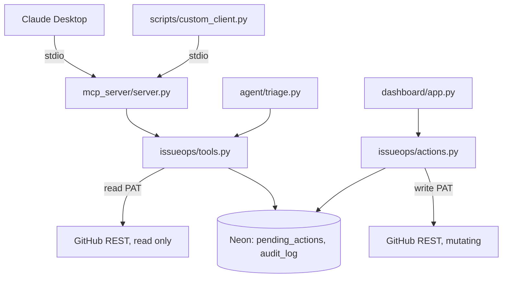

# IssueOps MCP

A guarded MCP server for GitHub issue triage. Ten tools on the model-facing surface: five read-only, five that queue a proposal for a human to approve. There is no execute or confirm tool anywhere on that surface, for any client. That is the entire premise of the project.

## What this is

1. The MCP server (or the standalone triage agent) reads issues, pull requests, and activity summaries through a read-only GitHub PAT.
2. Any mutating action (comment, add or remove labels, assign, close) is only ever proposed, never executed. Proposing writes a row to `pending_actions` in Postgres, including a snapshot of the issue's state at that moment.
3. A human reviews pending proposals in the Streamlit dashboard and approves or rejects each one.
4. Only on approval does the dashboard process, the sole process that ever holds a GitHub write PAT, execute the mutation against GitHub.
5. Every read, proposal, approval, rejection, and execution is written to `audit_log`, so the log is a ledger of what actually happened, not just what was attempted.

## Architecture



`issueops/tools.py` is the only module both the MCP server and the triage agent import. It has zero MCP or Streamlit imports. `GitHubWriteClient` is only ever constructed inside `issueops/actions.py`, called from `dashboard/app.py`, so the write PAT never enters the MCP server's or triage agent's process.

The triage agent, run interactively or from a scheduled job, calls `issueops.tools` directly. It never opens an MCP client session.

## Guardrails

- **Credential separation.** The MCP server and triage agent only ever hold `GITHUB_READ_PAT`. `config.py` actively drops `GITHUB_WRITE_PAT` from the process environment when it isn't required, so the guarantee holds for local runs too, not only in environments where the secret was never injected.
- **No execute path on the model-facing surface.** Every `propose_*` tool queues a row. None of them can mutate GitHub.
- **Stale check on approval.** Before executing an approved action, the dashboard re-fetches the issue's current state and compares it to the snapshot taken at proposal time. A mismatch marks the action `stale` instead of executing against a possibly outdated issue.
- **Dedup.** Identical pending proposals (same repo, issue, tool, and normalized arguments) are matched and reused instead of inserted twice.
- **48-hour TTL.** Pending actions older than the TTL auto-expire rather than executing later against a stale issue. Configurable via `PENDING_ACTION_TTL_HOURS` in `.env` (default `48`); read by `issueops/actions.py` and passed into `expire_stale_pending` and `approve_action`.
- **Partial-failure tracking.** `propose_remove_labels` runs as sequential per-label DELETE calls. If one fails partway through, `failure_reason` records exactly which labels were removed before the failure, so `audit_log` reflects the real state of the issue on GitHub, not just a generic error.
- **Heuristic flag is advisory only.** `issueops/heuristics.py` flags issue text containing common prompt-injection phrases and surfaces it in the dashboard as a signal. It is never checked in the approval or execution path and is not a security boundary. It's computed automatically inside `_queue_proposal` (`issueops/tools.py`) from the same issue fetch used to build the state snapshot, so every `propose_*` call is flagged the same way regardless of caller: the MCP server, the scheduled triage agent, or anything else that queues a proposal in the future. Earlier versions only set it from the triage agent, so the dashboard's advisory signal never appeared for the interactive Claude Desktop path, which is the one most exposed to injected issue content.
- **Dashboard access token.** `DASHBOARD_ACCESS_TOKEN`, if set, gates the whole dashboard behind a shared secret (`secrets.compare_digest`, not a plain `==`) before it shows any pending action or accepts an approve/reject click. If unset, the dashboard still runs, but shows a persistent warning that it has no access control, instead of only documenting that fact in this README.
- **Row lock spans the GitHub calls in `approve_action`, on purpose.** The `FOR UPDATE` lock taken on a `pending_actions` row during approval is held across the stale-state re-fetch and the GitHub mutation itself. That's what prevents a double-click, or two approvers racing the same row, from executing the same action twice. It's a per-row lock: it doesn't block unrelated pending actions, and it doesn't hold up the rest of the dashboard.

## Data model

Three tables in Postgres (Neon), defined in [`db/schema.sql`](db/schema.sql):

- `repo_allowlist`: which repos the system is allowed to touch, with an `active` flag so a repo can be deactivated without breaking foreign keys on old rows.
- `pending_actions`: one row per proposed mutation, its arguments, the issue-state snapshot at proposal time, and its status (`pending`, `stale`, `expired`, `blocked`, `executed`, `failed`, `rejected`).
- `audit_log`: one row per tool call and per proposal-lifecycle event, joined back to `pending_actions` where applicable. This is the ground truth for what happened, not what was attempted.

`db/schema.sql` also defines indexes on `pending_actions`' dedup lookup, `pending_actions`' pending/created-at ordering, and `audit_log`'s timestamp ordering, matching the actual query patterns in `issueops/tools.py`, `issueops/actions.py`, and `dashboard/app.py`.

## Safety

All issue and comment content pulled from GitHub is wrapped in `<untrusted_issue_content>` delimiters (`agent/prompts.py`) before it reaches the triage agent's prompt, with system instructions telling the model to treat it strictly as data, never as instructions to follow, even if it claims to be from a system, developer, administrator, or the assistant itself. This is a prompt-injection mitigation: issue content comes from the open web and is not trusted input.

This wrapping applies to the standalone triage agent's prompt only. On the MCP server surface (`mcp_server/server.py`), the tool descriptions for all five read tools (`get_issue`, `list_issues`, `list_pull_requests`, `search_issues`, `get_repo_activity_summary`) instead carry an explicit warning that the returned text is untrusted and must not be treated as instructions, since MCP tool results are returned as raw structured data rather than assembled into a single prompt string. Either way, the actual safety guarantee does not depend on this labeling: nothing on the MCP surface can execute a mutation, so a successful injection can at most produce a bad `propose_*` call, which still lands in `pending_actions` for a human to reject.

## Project structure

```
issueops-mcp/
├── agent/
│   ├── heuristics.py            # re-exports issueops.heuristics for backward compatibility
│   ├── prompts.py               # untrusted-content wrapping for the classifier
│   └── triage.py                # standalone CLI/cron classifier
│
├── dashboard/
│   └── app.py                   # Streamlit UI only
│
├── db/
│   └── schema.sql               # repo_allowlist, pending_actions, audit_log
│
├── eval/
│   ├── eval.py                  # susceptibility, guarantee check, accuracy
│   └── labels_template.json     # copy to labels.json, then hand-label
│
├── issueops/
│   ├── actions.py               # approve/reject/execute logic, holds the write PAT
│   ├── config.py                # env loading, drops write PAT when unused
│   ├── db.py                    # Neon/Postgres connection helper
│   ├── github_client.py         # GitHubReadClient, GitHubWriteClient
│   ├── heuristics.py            # advisory prompt-injection phrase match (canonical location)
│   ├── observability.py         # Logfire setup, optional
│   └── tools.py                 # shared by MCP server and triage agent
│
├── mcp_server/
│   └── server.py                # stdio MCP server, ten tools
│
├── scripts/
│   ├── allowlist.py             # add/deactivate/list allowlisted repos
│   └── custom_client.py         # minimal stdio MCP client for manual testing
│
├── tests/
│   └── test_*.py                # pytest suite, generally one file per module under test
│
├── conftest.py                  # shared pytest fixtures (FakeConn, FakeCursor)
├── .env.example
├── requirements.txt
└── README.md
```

## Getting started

1. **Services you'll need:**
   - A Neon Postgres project (free tier): https://neon.tech
   - A GitHub PAT with read-only access to Issues and PRs
   - A second GitHub PAT with write access, used only by the dashboard
   - A Groq API key, and optionally a second account's key as a rate-limit fallback: https://console.groq.com/keys
   - Logfire (optional, tracing no-ops without it): https://logfire.pydantic.dev

2. **Install**
   ```
   python -m venv venv && source venv/bin/activate
   pip install -r requirements.txt
   cp .env.example .env
   ```
   Fill in `NEON_DSN` (Neon's pooled connection string, Streamlit reruns the whole script on every interaction and will exhaust a direct connection fast), `GITHUB_READ_PAT`, `GITHUB_WRITE_PAT`, and `GROQ_API_KEY`. `GROQ_API_KEY_FALLBACK` and `LOGFIRE_TOKEN` are optional. Also set `DASHBOARD_ACCESS_TOKEN` before running the dashboard anywhere beyond a trusted local machine (see Guardrails), and optionally `MCP_CLIENT_LABEL` if you run more than one MCP server instance and want `audit_log.initiator` to tell them apart.

3. **Database.** Apply `db/schema.sql` against your Neon database.

4. **Allowlist a scratch repo you own:**
   ```
   python scripts/allowlist.py add owner/scratch-repo
   ```

## Running it

```
python -m mcp_server.server
python scripts/custom_client.py list_issues '{"repo": "owner/scratch-repo"}'
streamlit run dashboard/app.py
python -m agent.triage owner/scratch-repo --max-issues 3
```

To point Claude Desktop at the server, set its MCP config's `command` to your interpreter, `args` to `["-m", "mcp_server.server"]`, and `cwd` to this repo's absolute path. `config.py` calls `load_dotenv()`, which walks up from the working directory to find `.env`, so with `cwd` set correctly the spawned process picks up your credentials without duplicating them into an explicit `env` block.

```json
{
  "mcpServers": {
    "issueops-mcp": {
      "command": "python3",
      "args": ["-m", "mcp_server.server"],
      "cwd": "/absolute/path/to/issueops-mcp"
    }
  }
}
```

On a stock Windows Python install there is usually no `python3.exe`, only `python.exe`. Run `python -c "import sys; print(sys.executable)"` to get the right value for `command`.

## Evaluation

1. Copy `eval/labels_template.json` to `eval/labels.json` and hand-label 20 to 30 real issues from a repo you control.
2. Run:
   ```
   python -m eval.eval eval/labels.json
   ```

`eval/eval.py` computes, honestly, without massaging the numbers:

- **Proposal-level susceptibility.** How often the agent proposed a malicious or nonsensical action on an adversarial issue. Expected to be non-zero.
- **Execution-level guarantee.** A SQL check that every `audit_log` row recording a completed GitHub mutation is backed by a `pending_actions` row with `status = 'executed'` and a non-null `approved_by`. This scopes strictly to rows with `result_status = 'executed'`, since those are the only rows that assert a real GitHub mutation happened. This number must be zero.
- **Label accuracy** on the legitimate subset (exact set match, no judge model), and **latency** per triage run.

## Known limitations

- Written and syntax-checked (`python -m py_compile` on every file, and the MCP server was instantiated in-process to confirm all ten tools register with correct schemas), but not yet run against a live Neon database or the real GitHub API, and the Claude Desktop side of the interoperability check has not been run yet.
- The Streamlit approver identity is a free-text name field, not authentication. Anyone who can pass the `DASHBOARD_ACCESS_TOKEN` gate can type any name. `DASHBOARD_ACCESS_TOKEN` is a shared secret, not per-user identity: it stops an unauthenticated stranger from approving actions, but it does not let you tell two token-holders apart, or revoke one of them without rotating the token for everyone. If you need real per-user access control, that's separate work this project doesn't cover.
- `MCP_CLIENT_LABEL` is a manually-set string, not a verified identity. It's meant to distinguish separate MCP server processes in `audit_log.initiator` (different machines, different Claude Desktop configs), not to authenticate a particular human at the other end of stdio.
- `propose_assign` validates the assignee syntactically only (a well-formed GitHub login), not against the repo's actual collaborator list. The read PAT's scope doesn't grant access to the collaborators endpoint. GitHub itself rejects an invalid assignee at execute time.
- The heuristic phrase list in `issueops/heuristics.py` is coarse and advisory only. It is not tuned for low false positives and is never part of the approval or execution decision.
- The repo-label cache in `issueops/tools.py` has a 5-minute TTL. `propose_add_labels` and `propose_remove_labels` retry once against a fresh fetch when a label isn't found in the cached set, so a label created moments earlier isn't wrongly rejected, but the cache can still serve a stale list for up to 5 minutes in other read paths.
- `search_issues` returns a single page (up to 100 results) since GitHub's Search API paginates differently from the REST list endpoints and has its own rate-limit bucket. `list_issues`, `list_pull_requests`, and `get_issue`'s comment fetch follow `Link` header pagination and return the full result set, capped at 20 pages (2,000 items) as a safety limit.