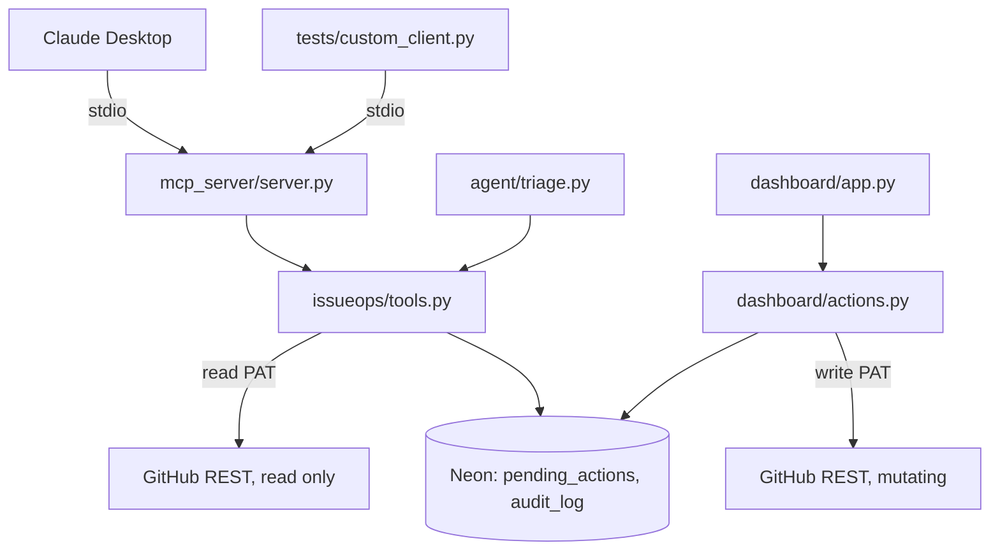

# IssueOps MCP

A guarded MCP server for GitHub issue triage. Ten tools on the model-facing surface: five read-only, five that queue a proposal for a human to approve. There is no execute or confirm tool anywhere on that surface, for any client. That is the entire premise of the project.

## What this is

1. The MCP server (or the standalone triage agent) reads issues, pull requests, and activity summaries through a read-only GitHub PAT.
2. Any mutating action (comment, add or remove labels, assign, close) is only ever proposed, never executed. Proposing writes a row to `pending_actions` in Postgres, including a snapshot of the issue's state at that moment.
3. A human reviews pending proposals in the Streamlit dashboard and approves or rejects each one.
4. Only on approval does the dashboard process, the sole process that ever holds a GitHub write PAT, execute the mutation against GitHub.
5. Every read, proposal, approval, rejection, and execution is written to `audit_log`, so the log is a ledger of what actually happened, not just what was attempted.

## Architecture



`issueops/tools.py` is the only module both the MCP server and the triage agent import. It has zero MCP or Streamlit imports. `GitHubWriteClient` is only ever constructed inside `dashboard/actions.py`, so the write PAT never enters the MCP server's or triage agent's process.

The triage agent, run interactively or from a scheduled job, calls `issueops.tools` directly. It never opens an MCP client session.

## Guardrails

- **Credential separation.** The MCP server and triage agent only ever hold `GITHUB_READ_PAT`. `config.py` actively drops `GITHUB_WRITE_PAT` from the process environment when it isn't required, so the guarantee holds for local runs too, not only in environments where the secret was never injected.
- **No execute path on the model-facing surface.** Every `propose_*` tool queues a row. None of them can mutate GitHub.
- **Stale check on approval.** Before executing an approved action, the dashboard re-fetches the issue's current state and compares it to the snapshot taken at proposal time. A mismatch marks the action `stale` instead of executing against a possibly outdated issue.
- **Dedup.** Identical pending proposals (same repo, issue, tool, and normalized arguments) are matched and reused instead of inserted twice.
- **48-hour TTL.** Pending actions older than 48 hours auto-expire rather than executing later against a stale issue.
- **Partial-failure tracking.** `propose_remove_labels` runs as sequential per-label DELETE calls. If one fails partway through, `failure_reason` records exactly which labels were removed before the failure, so `audit_log` reflects the real state of the issue on GitHub, not just a generic error.
- **Heuristic flag is advisory only.** `agent/heuristics.py` flags issue text containing common prompt-injection phrases and surfaces it in the dashboard as a signal. It is never checked in the approval or execution path and is not a security boundary.

## Data model

Three tables in Postgres (Neon), defined in [`db/schema.sql`](db/schema.sql):

- `repo_allowlist`: which repos the system is allowed to touch, with an `active` flag so a repo can be deactivated without breaking foreign keys on old rows.
- `pending_actions`: one row per proposed mutation, its arguments, the issue-state snapshot at proposal time, and its status (`pending`, `stale`, `expired`, `blocked`, `executed`, `failed`, `rejected`).
- `audit_log`: one row per tool call and per proposal-lifecycle event, joined back to `pending_actions` where applicable. This is the ground truth for what happened, not what was attempted.

## Safety

All issue and comment content pulled from GitHub is wrapped in `<untrusted_issue_content>` delimiters (`agent/prompts.py`) before it reaches the triage agent's prompt, with system instructions telling the model to treat it strictly as data, never as instructions to follow, even if it claims to be from a system, developer, administrator, or the assistant itself. This is a prompt-injection mitigation: issue content comes from the open web and is not trusted input.

## Project structure

```
issueops-mcp/
├── agent/
│   ├── heuristics.py           # advisory prompt-injection phrase match
│   ├── prompts.py               # untrusted-content wrapping for the classifier
│   └── triage.py                # standalone CLI/cron classifier
│
├── dashboard/
│   ├── actions.py               # approve/reject logic, holds the write PAT
│   └── app.py                   # Streamlit UI
│
├── db/
│   └── schema.sql               # repo_allowlist, pending_actions, audit_log
│
├── eval/
│   ├── eval.py                  # susceptibility, guarantee check, accuracy
│   └── labels_template.json     # copy to labels.json, then hand-label
│
├── issueops/
│   ├── config.py                # env loading, drops write PAT when unused
│   ├── db.py                    # Neon/Postgres connection helper
│   ├── github_client.py         # GitHubReadClient, GitHubWriteClient
│   ├── observability.py         # Logfire setup, optional
│   └── tools.py                 # shared by MCP server and triage agent
│
├── mcp_server/
│   └── server.py                # stdio MCP server, ten tools
│
├── scripts/
│   └── allowlist.py             # add/deactivate/list allowlisted repos
│
├── tests/
│   └── custom_client.py         # minimal stdio MCP client for testing
│
├── .env.example
├── requirements.txt
└── README.md
```

## Getting started

1. **Services you'll need:**
   - A Neon Postgres project (free tier): https://neon.tech
   - A GitHub PAT with read-only access to Issues and PRs
   - A second GitHub PAT with write access, used only by the dashboard
   - A Groq API key, and optionally a second account's key as a rate-limit fallback: https://console.groq.com/keys
   - Logfire (optional, tracing no-ops without it): https://logfire.pydantic.dev

2. **Install**
   ```
   python -m venv venv && source venv/bin/activate
   pip install -r requirements.txt
   cp .env.example .env
   ```
   Fill in `NEON_DSN` (Neon's pooled connection string, Streamlit reruns the whole script on every interaction and will exhaust a direct connection fast), `GITHUB_READ_PAT`, `GITHUB_WRITE_PAT`, and `GROQ_API_KEY`. `GROQ_API_KEY_FALLBACK` and `LOGFIRE_TOKEN` are optional.

3. **Database.** Apply `db/schema.sql` against your Neon database.

4. **Allowlist a scratch repo you own:**
   ```
   python scripts/allowlist.py add owner/scratch-repo
   ```

## Running it

```
python -m mcp_server.server
python tests/custom_client.py list_issues '{"repo": "owner/scratch-repo"}'
streamlit run dashboard/app.py
python -m agent.triage owner/scratch-repo --max-issues 3
```

To point Claude Desktop at the server, set its MCP config's `command` to your interpreter, `args` to `["-m", "mcp_server.server"]`, and `cwd` to this repo's absolute path. `config.py` calls `load_dotenv()`, which walks up from the working directory to find `.env`, so with `cwd` set correctly the spawned process picks up your credentials without duplicating them into an explicit `env` block.

```json
{
  "mcpServers": {
    "issueops-mcp": {
      "command": "python3",
      "args": ["-m", "mcp_server.server"],
      "cwd": "/absolute/path/to/issueops-mcp"
    }
  }
}
```

On a stock Windows Python install there is usually no `python3.exe`, only `python.exe`. Run `python -c "import sys; print(sys.executable)"` to get the right value for `command`.

## Evaluation

1. Copy `eval/labels_template.json` to `eval/labels.json` and hand-label 20 to 30 real issues from a repo you control.
2. Run:
   ```
   python -m eval.eval eval/labels.json
   ```

`eval/eval.py` computes, honestly, without massaging the numbers:

- **Proposal-level susceptibility.** How often the agent proposed a malicious or nonsensical action on an adversarial issue. Expected to be non-zero.
- **Execution-level guarantee.** A SQL check that every `audit_log` row recording a completed GitHub mutation is backed by a `pending_actions` row with `status = 'executed'` and a non-null `approved_by`. This scopes strictly to rows with `result_status = 'executed'`, since those are the only rows that assert a real GitHub mutation happened. This number must be zero.
- **Label accuracy** on the legitimate subset (exact set match, no judge model), and **latency** per triage run.

## Known limitations

- Written and syntax-checked (`python -m py_compile` on every file, and the MCP server was instantiated in-process to confirm all ten tools register with correct schemas), but not yet run against a live Neon database or the real GitHub API, and the Claude Desktop side of the interoperability check has not been run yet.
- The Streamlit approver identity is a free-text name field, not authentication. Anyone with dashboard access can type any name. If you need real access control here, that's separate work this project doesn't cover.
- `propose_assign` validates the assignee syntactically only (a well-formed GitHub login), not against the repo's actual collaborator list. The read PAT's scope doesn't grant access to the collaborators endpoint. GitHub itself rejects an invalid assignee at execute time.
- The heuristic phrase list in `agent/heuristics.py` is coarse and advisory only. It is not tuned for low false positives and is never part of the approval or execution decision.
