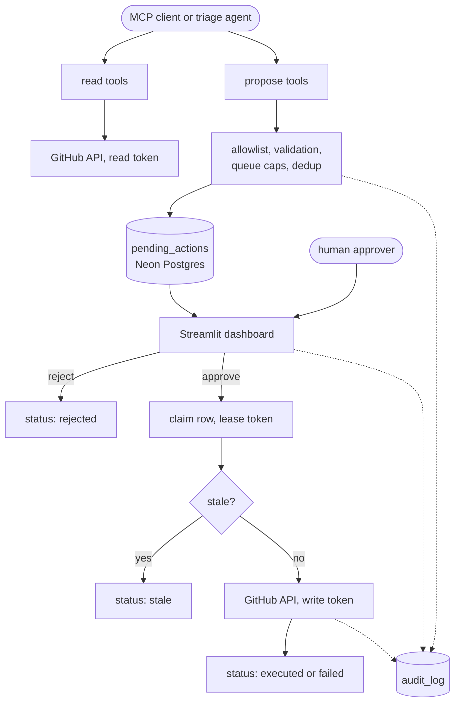

# IssueOps MCP

A human-in-the-loop GitHub issue triage system. An MCP client (Claude Desktop) or a scheduled triage agent can read issues and *propose* changes: comments, labels, assignees, closing. Nothing reaches GitHub until a person approves the proposal in a Streamlit dashboard, and every read, proposal, and decision is written to an audit log.

Built on free-tier infrastructure: a Neon Postgres database, Groq for the classifier, and fine-grained GitHub tokens.

## What this is

Given an allowlisted repository, the system:

1. Exposes 10 MCP tools: 5 read tools and 5 propose tools. The propose tools never call GitHub's write API.
2. Validates each proposal (allowlist, arguments, queue limits, duplicates), snapshots the issue, and queues it in Postgres as a `pending_actions` row.
3. Shows queued proposals in a dashboard, where a human reads the source issue and approves or rejects.
4. On approval, claims the row with a lease, re-fetches the issue, checks it hasn't changed in a way that matters, and only then writes to GitHub using a separate write token.
5. Records everything in `audit_log`, including proposals that were deduplicated, rejected as invalid, went stale, or failed.

A scheduled triage agent (`agent/triage.py`) uses the same propose path. It classifies open issues with an LLM and queues labels, comments, assignments, or closes for a human to review.

## Architecture



Design notes for each step (lease-based claiming, the stale check, crash recovery, transaction discipline) are in [`docs/architecture.md`](docs/architecture.md).

## Processes and credentials

Each process is started separately and loads only the credentials it needs, from a single `.env` file.

| Process | Entry point | Credentials | Writes to GitHub |
|---|---|---|---|
| MCP server | `python -m mcp_server.server` | read token | No |
| Triage agent | `python -m agent.triage` | read token, Groq key | No |
| Dashboard | `streamlit run dashboard/app.py` | read token, write token | Yes, only after a human approves |

`load_config(require_write_pat=False)` never reads the write token from the env file, drops it if it was inherited from the environment, and makes a later write-mode load in the same process raise. The Groq key is only required by the triage agent and the eval, so the dashboard does not hold an LLM key. So even with one shared `.env`, the MCP server and triage agent processes never hold `GITHUB_WRITE_PAT` in memory, only the dashboard does. Details and limits of this approach are in [`docs/architecture.md`](docs/architecture.md#credential-separation).

## MCP tools

| Kind | Tool | What it does |
|---|---|---|
| Read | `list_issues` | List issue summaries by state, labels, and recency. At most `limit` items (default 50, maximum 100) with a `truncated` flag, body excerpts only, pull requests marked `is_pull_request` |
| Read | `get_issue` | One issue with its 30 newest comments. Body and comments are clipped, and the result says how many comments were omitted |
| Read | `list_pull_requests` | List pull request summaries. At most `limit` items (default 50, maximum 100) with a `truncated` flag |
| Read | `search_issues` | Search within one repo. `repo:`, `org:`, `user:`, `owner:` qualifiers are rejected and results from other repos are dropped. Results are summaries with body excerpts |
| Read | `get_repo_activity_summary` | Issues opened, issues closed, distinct issues with comments, and opened issues by label, over 1 to 365 days. On very busy repos the counts are returned as lower bounds with `truncated: true` instead of failing |
| Propose | `propose_add_comment` | Queue a comment |
| Propose | `propose_add_labels` | Queue label additions, checked against the repo's labels |
| Propose | `propose_remove_labels` | Queue label removals |
| Propose | `propose_assign` | Queue an assignee, checked against the repo's assignable users |
| Propose | `propose_close` | Queue closing, optionally as `completed` or `not_planned` |

## Triage agent

- **Model:** `openai/gpt-oss-20b` on Groq by default (`--model` to change). One call per issue, JSON mode requested with one fallback call if the model rejects it, and rate-limit responses are retried once after the `retry-after` delay before the call is given up on.
- **Trusted context:** the classifier is told the issue's state, current labels and assignees, the labels that exist on the repo, and who can be assigned. Untrusted issue text is passed separately, inside delimiters.
- **Allowed proposals:** by default the agent only proposes labels and assignments. Free-text comments need `--allow-comment` and closes need `--allow-close`, because a comment body is the natural payload for a prompt-injected issue. Even with the flags on, an issue that trips the injection phrase check gets labels and assignments only.
- **Plan filtering:** proposals for labels already on the issue, labels not on the repo, assignees who are already assigned or not assignable, and closes on issues that are not open are dropped before anything is queued.
- **Memory:** issues that already have an agent proposal in status `pending`, `approving`, `rejected`, or `executed` are skipped on later runs. `needs_review` proposals count as handled. `expired`, `failed`, and `stale` proposals do not count, so those issues are re-evaluated. Every issue the agent looks at is also recorded in `triage_attempts`. An issue where the model proposed nothing is skipped until its title or body changes. Empty or unparseable model output is not treated as "nothing to propose": it is an error, so it is retried up to 3 times like any other per-issue error, and JSON wrapped in prose is recovered when possible. Only deterministic per-issue errors count toward those 3 tries. Provider rate limits, timeouts, connection failures, database connection failures, and GitHub 5xx, 429 or rate limit 403 responses are transient: they are not recorded, so an outage or an exhausted free-tier quota never blacklists an issue. Systemic failures are handled separately: a rejected or revoked Groq key, a model that no longer exists, a GitHub 401 or non-rate-limit 403, a repo that is no longer allowlisted, and a missing database grant or table stop the run at the first occurrence, record nothing for the issue, print the cause, and exit with status 1, so a broken configuration cannot retire issues one by one. Without this, issues that need no action would fill the `--max-issues` slots on every run and later issues would never be reached.
- **Rate limits:** when the model provider is still rate limiting after the built-in retry, the run stops instead of spending the rest of the issues on failed calls.
- **Full queue:** if a proposal is refused because the initiator's queue is full, the run stops instead of spending model calls on issues it cannot queue, and those issues are not recorded so they are retried next time.
- **Rationale:** the model's rationale is stored with each proposal and shown to the approver.
- **Flags:** `--state`, `--max-issues`, `--since`, `--max-pages`, `--model`.
- **Listing:** issues are read page by page and listing stops as soon as `--max-issues` candidates are found. If `--max-pages` is reached first, the run continues with the candidates it has and prints a warning to stderr instead of aborting.
- **Prompt size:** the classifier sees at most 300 characters of title, 8000 of body, and the 10 most recent comments (1500 characters each, 6000 in total), with truncation noted inline, so a huge issue cannot exceed the model's request limits.
- **Names:** repo names are lower-cased everywhere. Label and assignee names are matched case-insensitively and stored with the spelling GitHub uses.

## Guardrails

- **Human approval:** no propose tool can write to GitHub. Only the dashboard process holds the write token.
- **Repo allowlist:** every read and propose call checks `repo_allowlist.active` first. Deactivating a repo keeps its history intact.
- **Lease-based claiming:** approval flips a row from `pending` to `approving` in a short transaction and returns a lease token. Every later write is conditioned on that lease, so two approvers cannot both execute the same action. No database lock is held across a GitHub call.
- **Scoped stale check:** an approval is refused if the title or body changed, if a close targets an issue that is no longer open, if a label to remove is already gone, or if an identical comment already exists. Unrelated changes do not block sibling proposals.
- **Proposal-time checks:** the propose tools reject actions that can only go stale, such as closing an issue that is not open, removing a label the issue does not have, adding labels it already has, or assigning someone already assigned.
- **Transient failures:** if GitHub cannot be read while approving, nothing has been sent, so the claim is released and the row returns to `pending` for a retry. Only a missing issue (404 or 410) fails the action permanently. After a successful GitHub write, recording the result is retried on a fresh connection, and a persistent database failure is reported as `recording_failed` instead of an exception.
- **Outcome checks:** after an assign, the response is checked and the action fails if GitHub did not apply it. A network failure during a write is reported as `outcome_unknown` so the approver checks GitHub before retrying.
- **Queue limits:** at most `MAX_PENDING_PER_ISSUE` (10) and `MAX_PENDING_PER_INITIATOR` (500) open proposals. The counts are checked inside the insert transaction while holding two advisory locks, one per initiator and one per issue, always taken in that order, so concurrent proposals cannot exceed either limit and cannot deadlock. This bounds what a prompt-injected client can queue. A first check before the issue is fetched makes a full queue fail fast. For label and assignee proposals that first check runs after the label or assignee lookup.
- **Timeouts:** every GitHub request has a 15 second timeout. Pagination raises `PaginationLimitExceededError` instead of silently truncating. Callers that can work with partial data (the triage agent, the activity summary, comment reads) catch it and flag the result as truncated.
- **Atomic bookkeeping:** every status change is written in the same transaction as its audit row: claim, executed, failed, stale, released, expired, recovered, and rejected. The claim also records who started the approval (`claimed_by`), so a crash mid-approval still shows who did it. If the connection drops after a write, the retry recognizes an already committed result by its lease and does not report a false lost lease.
- **Label recreation guard:** GitHub creates a label that does not exist when it is added to an issue. Approving an add-labels proposal re-reads the repo's labels and marks the action stale if any of them has been deleted since.
- **Crash recovery:** rows stuck in `approving` longer than `STUCK_APPROVING_RECOVERY_MINUTES` are recovered according to whether the GitHub call had begun. The approval writes `execution_started_at` under its lease immediately before the call, and refuses to call GitHub if that write fails. A stuck row without the marker never reached GitHub and returns to `pending`. A stuck row with the marker may have been applied, so it moves to `needs_review` instead. The dashboard lists those rows and a person checks GitHub, then records either that it was applied (the row becomes `executed`) or that it was not (the row returns to `pending`). Both resolutions write an audit row naming the person. Nothing with an unknown outcome is ever offered for approval again automatically.
- **Proposal expiry:** unapproved proposals expire after `PENDING_ACTION_TTL_HOURS` (48), with an audit entry per expired row.
- **Dashboard access:** the dashboard refuses to start unless `DASHBOARD_ACCESS_TOKEN` is set. Running without one needs an explicit `DASHBOARD_ALLOW_INSECURE=true`, meant for a machine only you can reach.
- **Review panel:** each pending action shows the model's rationale and the issue text stored with the proposal. The stored limits (300 characters of title, 8000 of body, the last 10 comments at 1500 characters each) come from the same constants as the classifier prompt, so for agent proposals the panel contains everything the model read. Proposals from MCP clients may have been based on more text, and the panel says so. If anything was cut it says that too, and if an injection phrase sits in text that was not stored it shows a separate error telling the approver to load the live issue. Matched injection phrases are listed, and a flagged proposal cannot be approved until the approver ticks an acknowledgement. The optional live view loads the current issue with comments.
- **Repo names:** the allowlist stores lower-case `owner/name` values and the database rejects `.` and `..` segments.
- **Secrets in memory:** `Config` excludes every credential from its `repr`, so logging the config object or a traceback that includes it cannot leak a token.

## Safety

Issue titles, bodies, and comments come from the open internet and are treated as untrusted. The classifier prompt wraps them in `<untrusted_issue_content>` markers, strips any copy of those markers out of the text first so an issue cannot fake a closing tag, and instructs the model to treat the content as data only. Tool descriptions carry the same warning for MCP clients. A coarse phrase check (`is_heuristically_flagged`) marks suspicious proposals in the dashboard, after Unicode normalization and removal of zero-width characters. It is a visible hint for the approver, not a security boundary.

## Project Structure
```
issueops-mcp/
├── issueops/
│   ├── config.py               # env loading, credential rules
│   ├── db.py                   # Postgres connection helper
│   ├── limits.py                # text limits shared by the classifier prompt and the review excerpt
│   ├── github_client.py        # read and write GitHub clients, pagination guard
│   ├── tools.py                # read tools, propose tools, validation, caps, audit writes
│   ├── actions.py              # approve, reject, expire, recover, lease handling
│   ├── heuristics.py           # advisory injection-phrase check
│   ├── projection.py           # slims and bounds what the MCP read tools return
│   └── observability.py        # optional Logfire setup
│
├── agent/
│   ├── prompts.py               # classifier prompt, trusted context, untrusted block
│   ├── triage.py                # scheduled triage agent and CLI
│   └── heuristics.py
│
├── mcp_server/server.py        # MCP server exposing the 10 tools
├── dashboard/
│   ├── app.py                   # Streamlit approval UI and audit log view
│   └── auth.py                  # access token check
│
├── db/
│   ├── schema.sql               # idempotent: creates a fresh database or upgrades an existing one
│   └── migrations/             # the same changes as separate steps
│
├── eval/
│   ├── eval.py                  # classification, adversarial, and audit-consistency checks
│   └── labels_template.json     # fixture format
│
├── scripts/
│   ├── allowlist.py             # add, deactivate, list allowlisted repos
│   ├── prune_audit_log.py       # delete audit rows older than N days
│   └── custom_client.py         # call one MCP tool from the command line
│
├── tests/                      # unit tests plus Postgres integration tests
├── docs/architecture.md
├── conftest.py                 # fake DB used by the unit tests
├── .github/workflows/ci.yml
├── .env.example
├── requirements.txt
└── README.md
```

## Getting started

1. **API keys and accounts**, you'll need:
   - GitHub, two fine-grained tokens on the target repo: a read token (Issues read, Pull requests read, Metadata read) and a write token (Issues read and write). Create them at https://github.com/settings/personal-access-tokens
   - Neon (free tier): https://neon.tech. Copy the pooled connection string.
   - Groq, for the triage agent and the eval: https://console.groq.com/keys
   - Logfire (optional, tracing just no-ops without it): https://logfire.pydantic.dev

2. **Install**
   ```
   python3 -m venv .venv && source .venv/bin/activate
   pip install -r requirements.txt
   cp .env.example .env   # fill in every key you have; leave the rest blank
   ```

3. **Database**, no local `psql` needed. Open your Neon project's **SQL Editor**, paste in [`db/schema.sql`](db/schema.sql), and run it. The script is idempotent, so the same file creates a fresh database and upgrades an existing one. It is safe to run again after pulling new versions.

4. **Allowlist a repo.** Nothing works on a repo until this is done.
   ```
   python scripts/allowlist.py add owner/repo
   ```

## Running it

Run these from the repo root, all reading the same `.env`:

| Command | What it does |
|---|---|
| `streamlit run dashboard/app.py` | Approval dashboard |
| `python -m agent.triage owner/repo --max-issues 5` | Queue label and assignment proposals from the triage agent. Add `--allow-comment` and `--allow-close` to also let it propose comments and closes |
| `python -m mcp_server.server` | MCP server over stdio |
| `python scripts/custom_client.py list_issues '{"repo": "owner/repo"}'` | Smoke-test one MCP tool |
| `python scripts/prune_audit_log.py --days 90` | Delete audit rows older than 90 days |

To use the MCP server from Claude Desktop, add this to `claude_desktop_config.json` with absolute paths, then restart it:
```
{
  "mcpServers": {
    "issueops": {
      "command": "/abs/path/issueops-mcp/.venv/bin/python",
      "args": ["-m", "mcp_server.server"],
      "env": { "PYTHONPATH": "/abs/path/issueops-mcp" }
    }
  }
}
```

In the dashboard, enter the access token and your name in the sidebar, expand a pending action, read the rationale and the issue text it was based on (tick the acknowledgement if it is flagged), optionally click **Load current issue from GitHub**, then **Approve** or **Reject**. Check the audit log at the bottom of the page and the issue on GitHub.

## Configuration

| Variable | Default | Purpose |
|---|---|---|
| `NEON_DSN` | required | Postgres connection string (pooled) |
| `GITHUB_READ_PAT` | required | Read token |
| `GITHUB_WRITE_PAT` | dashboard only | Write token |
| `GROQ_API_KEY` | triage agent and eval | LLM key |
| `LOGFIRE_TOKEN` | none | Enables tracing |
| `PENDING_ACTION_TTL_HOURS` | 48 | How long a proposal can wait |
| `STUCK_APPROVING_RECOVERY_MINUTES` | 10 | When an `approving` row is treated as crashed |
| `COMMENT_BODY_MAX_CHARS` | 65536 | Maximum proposed comment length |
| `MAX_PENDING_PER_ISSUE` | 10 | Open proposals per issue |
| `MAX_PENDING_PER_INITIATOR` | 500 | Open proposals per initiator |
| `MCP_CLIENT_LABEL` | none | Label recorded as the MCP initiator |
| `DASHBOARD_ACCESS_TOKEN` | none | Gates the dashboard. Required unless `DASHBOARD_ALLOW_INSECURE` is set |
| `DASHBOARD_ALLOW_INSECURE` | false | Lets the dashboard run without a token |
| `ISSUEOPS_ENV_FILE` | auto-discovered `.env` | Env file for this process, if you want to point somewhere other than the default `.env` |

## Testing

Run `pytest` from the repo root.

Most tests use the fake database in `conftest.py` to check SQL call sequences, and mocks for the GitHub clients. Those cannot verify locking. `tests/test_integration_postgres.py` runs against a real Postgres and covers concurrent approvals, lease reclamation, concurrent dedup, queue caps under concurrent proposals, deadlock freedom, atomic audit writes, retry after a dropped connection, triage memory, and the schema upgrade from a legacy database. `tests/test_dashboard.py` drives the dashboard headlessly, and its database-backed cases use the same variable. Both are skipped unless `TEST_DATABASE_URL` points at a scratch database. Each test creates and drops its own schema, and CI runs them against a Postgres service container.

## Evaluation

```
python -m eval.eval path/to/labels.json
```

Copy [`eval/labels_template.json`](eval/labels_template.json) as a starting point.

- **Classification accuracy** on non-adversarial issues, compared with `expected_labels`.
- **Adversarial behavior** on issues containing injected instructions, where the correct outcome is no action. `adversarial_any_action_rate` counts any proposal the plan would queue, and `proposal_level_susceptibility` also counts injection markers appearing in the model output.
- **Audit consistency**, checked in both directions between `audit_log` and `pending_actions`. Both tables are written by this code, so this catches bookkeeping bugs, not a write made outside the dashboard with the write token. Executed actions older than the most recent audit prune are not counted, because their audit rows were deleted on purpose. To catch a write made outside the dashboard, review the write token's activity in GitHub's audit log.

No labeled dataset is shipped, only the template.

## Known limitations

- The injection heuristic is advisory. An attacker only has to avoid the listed phrases.
- Approver identity in the dashboard is a typed name, not authentication. The access token gates the app but does not tell approvers apart.
- Recovery of a row stuck in `approving` runs on dashboard page loads, not in a background worker, and it is time-based rather than a liveness check. A row whose GitHub call had started moves to `needs_review`, and if the original call was only slow, its result is reported as `lost_lease_after_execution`. Either way a person must check GitHub and resolve it in the dashboard. A resolution is the resolver's word, recorded in the audit log, and is not verified against GitHub.
- The stale check does not cover new comments or edits to existing comments. The approver sees the comments as they were at proposal time and can load the current ones. A `stale` or `failed` action is terminal, so the agent can re-propose it on a later run but a person cannot retry it. A GitHub read failure during approval is not terminal: the row is released back to `pending`.
- `propose_remove_labels` calls GitHub once per label and can partially succeed. The failure message lists what was removed and what was not.
- The label and assignee caches are process-local with a 5 minute TTL and are not shared across workers.
- Very large repos can hit the pagination limit (20 pages, 2000 items by default). Listing calls over MCP stop at `limit` items (at most 100) and report `truncated`; narrow the query with `state`, `labels`, or `since` to reach older items. Triage, the activity summary, and comment reads return partial results flagged as truncated. When an issue has more than 2000 comments, only the first 2000 are read, so the duplicate-comment check on approval covers only those.
- The MCP initiator string includes the process id, so the per-initiator queue cap is per process, not per person.
- All processes share one Postgres role, so the audit log is append-only by convention (the code never issues an UPDATE, TRUNCATE, or DELETE against it outside `prune_audit_log.py`) rather than by database-enforced permission. Nothing in this repo stops a process holding the connection string from writing to `audit_log` directly.
- The MCP read tools return projected summaries, not raw GitHub JSON. Fields that are not projected (reactions, timeline URLs, full user objects, review data on pull requests) are not available to the client, and `get_issue` returns only the 30 newest comments, each clipped to 2500 characters.
- No dependency lockfile or license file is included. Choosing a license is up to the repository owner.
