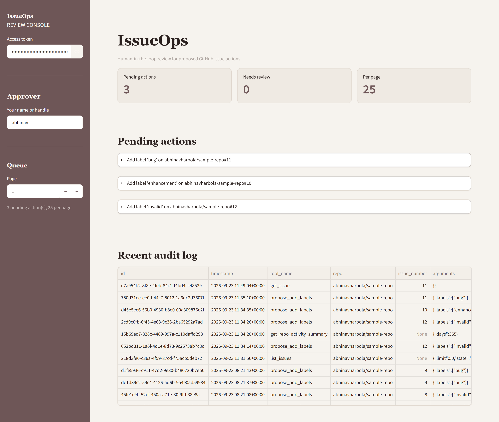
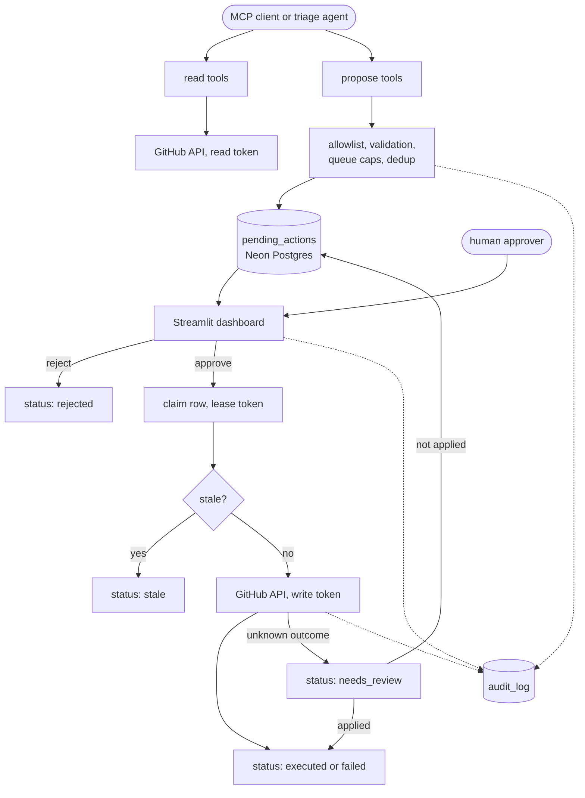

# IssueOps MCP

A human-in-the-loop GitHub issue triage system. An MCP client (Claude) or a triage agent reads issues and **proposes** changes (comments, labels, assignees, closing). Nothing reaches GitHub until a person approves it in a Streamlit dashboard, and every read, proposal, and decision is audit-logged.

Runs on free tiers: Neon Postgres, Groq for the classifier, and separate fine-grained GitHub PATs for read and write.

## Preview

<p align="center">
  
  <br>
  <sub>Landing view of the dashboard with queue metrics and the audit log.</sub>
</p>

> Additional screenshots in [`assets`](assets/).

## What this is

For an allowlisted repository, the system:

1. Exposes 10 MCP tools: 5 read, 5 propose. Propose tools never call GitHub's write API.
2. Validates each proposal (allowlist, arguments, not a pull request, queue limits, duplicates), snapshots the issue, and queues a `pending_actions` row.
3. Shows queued proposals in a dashboard where a human reviews the source issue and approves or rejects.
4. On approval, claims the row with a lease, re-fetches the issue, checks it is still valid, then writes with a separate write token.
5. Logs everything in `audit_log`, including deduplicated, invalid, stale, and failed proposals.
6. Sends writes with an unknowable outcome (network failure or GitHub 5xx mid-write) to `needs_review`, where a person checks GitHub and records the result.

The triage agent (`agent/triage.py`), run manually or from your own scheduler, uses the same propose path: it classifies open issues with an LLM and queues proposals for review.

## Architecture


```mermaid
flowchart TD
    client(["MCP client or triage agent"]) --> read["read tools"]
    client --> propose["propose tools"]
    read --> ghr["GitHub API, read token"]

    propose --> validate["allowlist, validation,<br/>queue caps, dedup"]
    validate --> queue[("pending_actions<br/>Neon Postgres")]

    queue --> dash["Streamlit dashboard"]
    human(["human approver"]) --> dash
    dash -->|reject| rejected["status: rejected"]
    dash -->|approve| claim["claim row, lease token"]

    claim --> check{"stale?"}
    check -->|yes| stale["status: stale"]
    check -->|no| ghw["GitHub API, write token"]
    ghw --> done["status: executed or failed"]
    ghw -->|unknown outcome| review["status: needs_review"]
    review -->|applied| done
    review -->|not applied| queue

    validate -.-> audit[("audit_log")]
    dash -.-> audit
    ghw -.-> audit
```

Details are in [Guardrails](#guardrails).

## Processes and credentials

Each process loads only the credentials it needs, and all need `NEON_DSN`. Use two env files: `.env` (from `.env.example`) for everything except the dashboard, and `.env.dashboard` (from `.env.dashboard.example`), the only file holding `GITHUB_WRITE_PAT`.

| Process | Entry point | Env file | Credentials | Writes to GitHub |
|---|---|---|---|---|
| MCP server | `python -m mcp_server.server` | `.env` | read token | No |
| Triage agent | `python -m agent.triage` | `.env` | read token, Groq key | No |
| Eval | `python -m eval.eval` | `.env` | read token, Groq key | No |
| Dashboard | `ISSUEOPS_ENV_FILE=.env.dashboard streamlit run dashboard/app.py` | `.env.dashboard` | read token, write token | Yes, only after a human approves |
| Database scripts | `scripts/migrate.py`, `scripts/allowlist.py`, `scripts/prune_audit_log.py` | `.env` | database DSN only | No |
| Smoke-test client | `python scripts/custom_client.py` | `.env` | starts the MCP server, so read token | No |

`load_config(require_write_pat=False)` never reads the write token from a file, drops it if inherited from the environment, and raises if write mode is loaded later in the same process. All processes share one Postgres role, so this separates GitHub credentials, not database access.

## MCP tools

| Kind | Tool | What it does |
|---|---|---|
| Read | `list_issues` | Issue summaries by state, labels, and recency. Excludes pull requests. Up to `limit` (default 50, max 100) with a `truncated` flag |
| Read | `get_issue` | One issue with its 30 newest comments, clipped, plus a count of omitted comments |
| Read | `list_pull_requests` | Pull request summaries, same `limit` and `truncated` behavior |
| Read | `search_issues` | Search within one repo. `repo:`, `org:`, `user:`, `owner:` qualifiers are rejected, other-repo results are dropped, and PRs are marked `is_pull_request` |
| Read | `get_repo_activity_summary` | Opened, closed, and commented issues, and opened issues by label, over 1 to 365 days |
| Propose | `propose_add_comment` | Queue a comment |
| Propose | `propose_add_labels` | Queue label additions, checked against the repo's labels |
| Propose | `propose_remove_labels` | Queue label removals |
| Propose | `propose_assign` | Queue an assignee, checked against the repo's assignable users |
| Propose | `propose_close` | Queue closing, optionally as `completed` or `not_planned` |

Read tools label issue text as untrusted. All propose tools reject pull request numbers.

## Triage agent

- **Model and scope:** `openai/gpt-oss-20b` on Groq (`--model` to override), one call per issue, with trusted context and untrusted issue text passed separately. By default it proposes only labels and assignments; `--allow-comment` and `--allow-close` unlock the rest, except on flagged (likely-injected) issues, which stay restricted. No-op proposals are filtered before queuing, and pull requests are never candidates.

- **Skip rules:** an issue is skipped while an agent proposal for it is `pending`, `approving`, `rejected`, `executed`, or `needs_review`; `expired`, `failed`, and `stale` proposals are reconsidered. A `proposed` record keeps an issue skipped only while a live or terminal proposal for it exists (from any initiator) and its title and body are unchanged. A `no_action` issue is skipped until its text changes.

- **Failures:** bad model output is not retried in-run. The issue is recorded as an error and retried on later runs until it fails 3 times with unchanged text. Model-provider and GitHub rate limits stop the run without being recorded against the issue; connection and server errors are transient and likewise unrecorded. Systemic failures (bad key, de-allowlisted repo, missing DB grant) stop the run and exit 1.

- **Flags:** `--state`, `--max-issues` (positive), `--since`, `--max-pages` (positive), `--model`, `--allow-comment`, `--allow-close`. The prompt caps title at 300 chars, body at 8000, and comments at 10 (1500 each, 6000 combined), noting truncation inline. The rationale is stored with each proposal and shown to the approver.

## Guardrails

- **Before queuing:** every call checks `repo_allowlist.active`. Deactivation keeps history, blocks new proposals, and marks queued ones `blocked` at approval. Proposals that are stale by construction (closing a non-open issue, adding an existing label, targeting a pull request) are rejected. `MAX_PENDING_PER_ISSUE` (10) and `MAX_PENDING_PER_INITIATOR` (500) are enforced transactionally with two ordered advisory locks, and duplicate `pending` or `approving` proposals (same repo, issue, tool, arguments) are dropped.

- **At approval:** only the dashboard holds the write token. Approval atomically moves `pending` to `approving` under a lease token required by every write, preventing concurrent execution without holding a DB lock across GitHub calls. Staleness is rechecked before writing: changed title or body, closed target, missing removal label, duplicate comment, or deleted label for an add blocks that proposal only.

- **GitHub calls:** 15 second timeout. Pagination errors rather than silently truncating, and next-page links must point at `https://api.github.com` exactly. An unreadable issue releases the claim to `pending`; only 404 and 410 fail permanently. Assignment responses are verified. A write failing with a network error or GitHub 5xx may have applied, so the row goes to `needs_review` (`outcome_unknown`); a 4xx is a definite `failed`. Post-write DB failures retry on a fresh connection, then become `recording_failed`. Each status transition, with claimant identity, is recorded atomically with its audit row.

- **Recovery:** `approving` rows stuck beyond `STUCK_APPROVING_RECOVERY_MINUTES` return to `pending` if the GitHub call never started, otherwise go to `needs_review`. Unknown outcomes are never auto-retried; a person records whether the change was applied, with an optional note. Requeueing gives a fresh expiry window (`requeued_at`). Unapproved proposals expire after `PENDING_ACTION_TTL_HOURS` (48), measured from creation or the last requeue, and are audited.

- **Dashboard and misc:** requires `DASHBOARD_ACCESS_TOKEN` unless `DASHBOARD_ALLOW_INSECURE=true`. Review panels show rationale and issue text within prompt limits, flag truncation, require acknowledgement for flagged proposals, and can reload live GitHub data and re-run the flag check. Rejections and resolutions take an optional reason or note. Allowlist names are lowercased and reject `.` and `..` segments. The `Config` repr excludes credentials.

## Safety

Issue titles, bodies, and comments are untrusted. The classifier prompt wraps them in `<untrusted_issue_content>` markers, strips any copy of those markers from the text first, and tells the model to treat the content as data. Tool descriptions carry the same warning for MCP clients. A coarse phrase check (`is_heuristically_flagged`, after Unicode normalization and zero-width-character removal) flags suspicious proposals in the dashboard and restricts what the agent may propose for a flagged issue. It over-triggers by design (a false positive costs an acknowledgement and a narrower proposal) and is not a security boundary.

## Project Structure
```
issueops-mcp/
├── issueops/
│   ├── config.py                # env loading, credential rules, DSN-only loader
│   ├── db.py                    # Postgres connection helper
│   ├── limits.py                # text limits, clip helper, env integer parsing
│   ├── github_client.py         # read and write GitHub clients, pagination guard
│   ├── tools.py                 # read tools, propose tools, validation, caps, audit writes
│   ├── actions.py               # approve, reject, expire, recover, resolve, lease handling
│   ├── heuristics.py            # advisory injection-phrase check
│   ├── projection.py            # slims and bounds what the MCP read tools return
│   └── observability.py         # optional Logfire setup
│
├── agent/
│   ├── prompts.py               # classifier prompt, trusted context, untrusted block
│   └── triage.py                # triage agent and CLI
│
├── mcp_server/server.py         # MCP server exposing the 10 tools
├── dashboard/
│   ├── app.py                   # Streamlit approval UI and audit log view
│   └── auth.py                  # access token check
│
├── db/
│   ├── schema.sql               # idempotent baseline: creates a fresh database or upgrades an existing one, and records every migration file below as applied
│   └── migrations/              # incremental changes, applied and tracked by scripts/migrate.py
│
├── eval/
│   ├── eval.py                  # classification, adversarial, and audit-consistency checks
│   └── labels_template.json     # fixture format
│
├── scripts/
│   ├── allowlist.py             # add, deactivate, list allowlisted repos
│   ├── migrate.py               # applies db/migrations/*.sql not yet recorded in schema_migrations
│   ├── prune_audit_log.py       # delete audit rows older than N days
│   └── custom_client.py         # call one MCP tool from the command line
│
├── assets/
├── tests/                       # unit tests plus Postgres integration tests
│
├── conftest.py                  # fake DB used by the unit tests
├── .github/workflows/ci.yml
├── .streamlit/config.toml
├── .env.example
├── .env.dashboard.example
├── .gitignore
├── requirements.txt
└── README.md
```

## Getting started

1. **Accounts and keys:**
   - GitHub: two fine-grained tokens on the target repo, read (Issues read, Pull requests read, Metadata read) and write (Issues read and write): https://github.com/settings/personal-access-tokens
   - Neon (free tier): https://neon.tech. Copy the pooled connection string.
   - Groq, for the agent and eval: https://console.groq.com/keys
   - Logfire (optional, tracing no-ops without it): https://logfire.pydantic.dev

2. **Install** (Python 3.10 or 3.12, as in CI). Set `NEON_DSN` and `GITHUB_READ_PAT` in `.env`, plus `GROQ_API_KEY` for the agent or eval. In `.env.dashboard`, set `NEON_DSN`, `GITHUB_READ_PAT`, `GITHUB_WRITE_PAT`, and `DASHBOARD_ACCESS_TOKEN` (or `DASHBOARD_ALLOW_INSECURE=true` on a machine only you can reach). Optional values can stay blank.
   ```
   python3 -m venv .venv && source .venv/bin/activate
   pip install -r requirements.txt
   cp .env.example .env
   cp .env.dashboard.example .env.dashboard
   ```

3. **Database** (no local `psql` needed). Run [`db/schema.sql`](db/schema.sql) once in your Neon project's **SQL Editor**. It is idempotent: it creates a fresh database or upgrades an existing one, touches only missing or outdated constraints, and records every file in `db/migrations/` in `schema_migrations`. Apply migrations added later with:
   ```
   python scripts/migrate.py
   ```
   It applies all pending files in one transaction under a transaction-level advisory lock (which works through Neon's pooled connection), so concurrent runs cannot double-apply and a failure leaves nothing half-applied. When adding a migration, also add its name to the `INSERT INTO schema_migrations` list at the end of `db/schema.sql` and fold its change into the baseline; `tests/test_schema_files.py` fails if they disagree.

4. **Allowlist a repo.** Nothing works on a repo until this is done.
   ```
   python scripts/allowlist.py add owner/repo
   ```

## Running it

Run from the repo root. Everything except the dashboard reads `.env`; the dashboard reads `.env.dashboard`.

| Command | What it does |
|---|---|
| `ISSUEOPS_ENV_FILE=.env.dashboard streamlit run dashboard/app.py` | Approval dashboard |
| `python -m agent.triage owner/repo --max-issues 5` | Queue label and assignment proposals. Add `--allow-comment` and `--allow-close` to include comments and closes |
| `python -m mcp_server.server` | MCP server over stdio |
| `python scripts/custom_client.py list_issues '{"repo": "owner/repo"}'` | Smoke-test one MCP tool |
| `python scripts/allowlist.py list` | List allowlisted repos (`add` and `deactivate` take a repo name) |
| `python scripts/migrate.py` | Apply pending migrations |
| `python scripts/prune_audit_log.py --days 90` | Delete audit rows older than 90 days |
| `python -m eval.eval path/to/labels.json` | Run the evaluation |

On Windows, activate with `.venv\Scripts\activate` and, in PowerShell, run `$env:ISSUEOPS_ENV_FILE=".env.dashboard"` before `streamlit run dashboard/app.py`.

To use the MCP server from Claude Desktop, add this to `claude_desktop_config.json` with absolute paths and restart it. The server reads credentials from the repo's `.env`, so they do not go in this file:
```
{
  "mcpServers": {
    "issueops": {
      "command": "/abs/path/issueops-mcp/.venv/bin/python",
      "args": ["-m", "mcp_server.server"],
      "env": { "PYTHONPATH": "/abs/path/issueops-mcp" }
    }
  }
}
```

In the dashboard: enter the access token and your name, expand a pending action, read the rationale and stored issue text (tick the acknowledgement if flagged), optionally **Load current issue from GitHub**, then **Approve** or **Reject** (optional reason). Rows under **Needs review** need a person to check GitHub and record whether the change was applied.

## Configuration

| Variable | Default | Purpose |
|---|---|---|
| `NEON_DSN` | required | Pooled Postgres connection string |
| `GITHUB_READ_PAT` | required, except for database-only scripts | Read token |
| `GITHUB_WRITE_PAT` | dashboard only, in `.env.dashboard` | Write token |
| `GROQ_API_KEY` | agent and eval only | LLM key |
| `LOGFIRE_TOKEN` | none | Enables tracing |
| `PENDING_ACTION_TTL_HOURS` | 48 | How long a proposal can wait |
| `STUCK_APPROVING_RECOVERY_MINUTES` | 10 | When an `approving` row counts as crashed |
| `COMMENT_BODY_MAX_CHARS` | 65536 | Max proposed comment length (GitHub's limit is 65536) |
| `MAX_PENDING_PER_ISSUE` | 10 | Open proposals per issue |
| `MAX_PENDING_PER_INITIATOR` | 500 | Open proposals per initiator |
| `MCP_CLIENT_LABEL` | none | Label recorded as the MCP initiator |
| `DASHBOARD_ACCESS_TOKEN` | none | Gates the dashboard. Required unless `DASHBOARD_ALLOW_INSECURE` is set |
| `DASHBOARD_ALLOW_INSECURE` | false | Lets the dashboard run without a token |
| `ISSUEOPS_ENV_FILE` | auto-discovered `.env` | Env file for this process. Set to `.env.dashboard` for the dashboard |

## Testing

```
pip install -r requirements.txt
pytest
```

Most tests use a fake database and mocked GitHub clients, so they cannot verify locking. `tests/test_integration_postgres.py` runs against real Postgres and covers concurrent approvals, lease reclamation, dedup, queue caps, deadlock freedom, atomic audit writes, dropped-connection retry, triage skip rules, requeue expiry, unknown write outcomes, schema re-application, the migration runner, and the legacy upgrade. `tests/test_dashboard.py` drives the dashboard headlessly and is skipped without Streamlit. Postgres-backed tests are skipped unless `TEST_DATABASE_URL` is set; each creates and drops its own schema, and CI runs them against a Postgres service container. `tests/test_schema_files.py` checks that `schema.sql` records every migration file.

## Evaluation

```
python -m eval.eval path/to/labels.json
```

Start from [`eval/labels_template.json`](eval/labels_template.json). The eval follows the triage agent's path: it fetches the repo's labels and assignable users, applies the heuristic flag, builds the plan through the same filtering, and enables comments and closes for unflagged issues.

- **Classification accuracy** on non-adversarial issues against `expected_labels`, compared case-insensitively after the agent's label filtering. `avg_latency_ms` times only the model call.

- **Adversarial behavior** on issues with injected instructions. `adversarial_any_action_rate` counts any planned proposal after flag gating, `marker_hit_rate` is the share of issues whose output echoes an injection marker, and `proposal_level_susceptibility` counts either. None distinguishes correctly labeling spam from obeying the injection; both read as `acted: true`. Propose tools are scoped to the single issue being classified, so an injected instruction cannot act beyond that row, and every proposal still needs human approval.

- **Audit consistency**, checked in both directions between `audit_log` and `pending_actions`. It catches bookkeeping bugs in this codebase, not writes made elsewhere. Pruned audit rows are excluded.

## Evaluation Metrics (Local Run)

These figures are synthetic: projected for the current pipeline under ideal conditions, not measured. Rerun `python -m eval.eval` to replace them.

12-issue fixture (9 legitimate, 3 adversarial) against `openai/gpt-oss-20b`:

| Metric                                           | Earlier eval (measured) | Current eval (synthetic) |
| ------------------------------------------------ | ----------------------- | ------------------------ |
| `label_accuracy`                                 | 9/9                     | 9/9                      |
| `adversarial_any_action_rate`                    | 3/3                     | 2/3                      |
| `proposal_level_susceptibility`                  | 3/3                     | 2/3                      |
| `marker_hit_rate` (injected phrases echoed)      | 0/3                     | 0/3                      |
| `avg_latency_ms`                                 | ~4800                   | ~4200                    |

Changes come from the eval now matching production. If all three adversarial issues contain listed injection phrases, they are flagged and closes and comments are disallowed: the two that earlier drew a close plus an `invalid` label would queue only the label, and the third nothing. Latency drops because only the model call is timed. Label accuracy should hold because matching is case-insensitive and filtered to existing repo labels. With `n=12` this is a smoke test, not a benchmark.

## Known limitations

- The injection heuristic is advisory and avoidable by omitting the listed phrases; it also over-triggers on legitimate LLM-related text.
- Approver identity is a typed name. The access token gates the app but does not identify approvers.
- `propose_remove_labels` calls GitHub once per label and can partially succeed; the failure message lists what was and was not removed.
- Label and assignee caches are process-local with a 5 minute TTL.
- Pagination caps at 20 pages or 2000 items by default. MCP listings stop at `limit` (max 100) and report `truncated`, and triage, activity summary, and comment reads flag partial results too. For issues with over 2000 comments only the first 2000 are read, so the duplicate-comment check covers only those.
- Without `MCP_CLIENT_LABEL`, the MCP initiator includes hostname and process id, so the per-initiator cap is per process. Setting it gives a stable initiator shared across restarts.
- All processes share one Postgres role. The audit log is append-only by convention (only `prune_audit_log.py` deletes from it), not by DB permissions. The two env files do not stop an operator from putting the write token in `.env`.
- MCP read tools return projected summaries, not raw GitHub JSON. `get_issue` returns the 30 newest comments, each clipped to 2500 characters.
- No scheduler is included; run the agent periodically yourself.
- **Load current issue** opens a short-lived DB connection per click instead of using the pool.
- Without `TEST_DATABASE_URL`, `pytest` skips the Postgres tests, so locking, schema guards, and database-backed dashboard flows go unexercised.
